# Project 3: Madelon Feature Selection and Classification

*Author: Uyen Truong*

### Project Description:

This project, I will be working on the Madelon dataset.  One set of data is downloaded from the UCI website and the other artificial dataset was queried from a Database. The dataset from UCI has 500 features and of these 500 features, only 20 are real, where 5 are informative, the other 15 are linear combinations of the 5 informative features. The dataset from the Database has 1000 features and 220,000 rows of data, no other information was given about this dataset in regards to the number of informative features.

The goal of the project is to use statistical models for feature slection and classification in order to best predict the examples into 2 classes corresponding to the target values (-1 or 1 for UCI dataset and 0 or 1 for Database dataset). 

### Initial Step:  Download the data and perform EDA
Although the instructions indicated that we needed to work on three 10% sets of the database dataset, computing such large datasets of about 22,000 rows and 1000 columns is computational intensive and constantly crashed AWS T-2Micro machine. Therefore, I used Survey Monkey Sample Size calculator to determine a sample size that would be suitable for analysis. I determined that a sample size that gives me 95% confidence interval and 1% margin error would be sufficient for analysis. According to Survey Monkey Calculator, this calls for about 5% of the dataset which is equivalent to about 9200-9500 rows of the Database dataset.  All of the calculations for the database dataset were run on three sets of 5% of the data.

Initial EDA of the datasets indicated that there are no null values in the data except for one column in the UCI dataset where all the values were NaN, so I dropped that column. A heatmap of the entire UCI dataset and a sample of the Database dataset show that there are significant noise in both sets and it is difficult to determine any correlation from looking at the map. 

A heatmap of the entire UCI dataset and a sample of the Database dataset show that there are significant noise in both sets and it is difficult to determine any correlation from looking at the map.

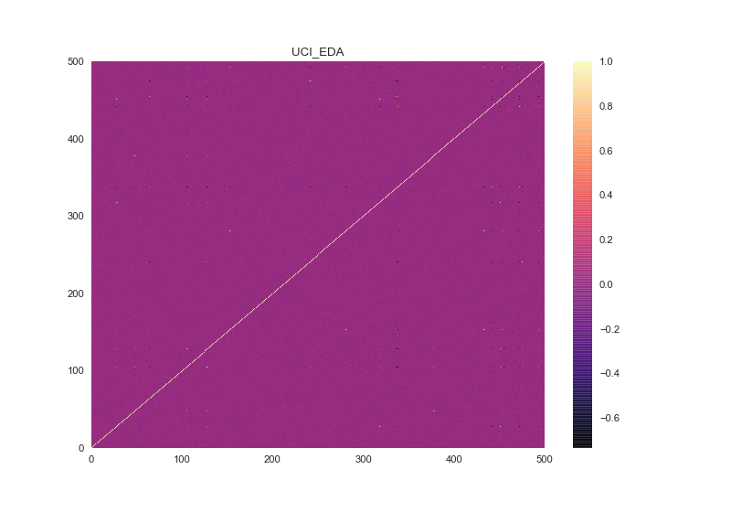

I alsocreated scatter plots of some of the features to see if there are any correlations but it was difficult to see if relationship between the features.
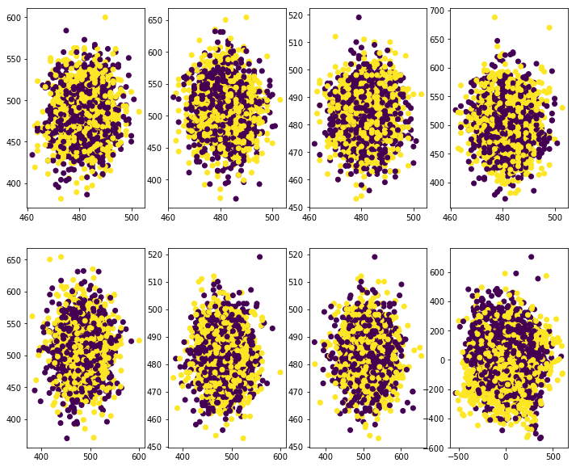

## Step 1: Benchmarking

I built pipelines to perform naive fits to set the benchmark scores with the entire UCI train dataset and 5% of Database dataset with the following models:

- Logistic Regression(LR)
- Decision Tree(Tree)
- K Nearest Neighbors(KNN)
- Support Vector Classier(SVC)

According to the project instructions, a large C must be set for Logistic Regression and Support Vector Classier to minimize regulization.  Therefore, I set the C value equal to 1e10 for both LR and SVC.  Below are the results of the benchmark scores. 

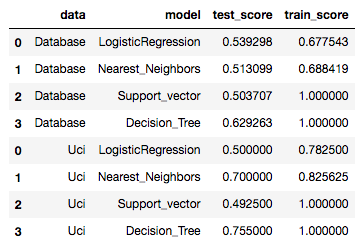

**Note:** the scores present throughout this notebook are Accuracy scores.

## Step 2: Finding Salient Features

Given the information about the UCI Madelon dataset where there are 480 'noisy' features out of the 500, I used the feature selection methods described below to identify the 20 relevant features.  While no information was given for the Madelon Database dataset, I assumed that it would have similar structure as the UCI dataset where there are many 'noisy' features, some redundant linear combinations and some informative features. Therefore, I applied the same methods on the Database dataset.

### Method 1: Calculate $R^2$ scores

In this method, the goal is to remove the actual target column and calculate the R^2 scores of each feature taking turn as the target.  This technique can tell us if there's a linear relationship between the features.  If the R^2 is high, that means there is a linear relationship with the other features; therefore, it could be one of the informative or redudant features.  If the $R^2$ is low, that means it is independent of the all other features and would most likely not be a redundant or informative feature. 

In this method, KneighborRegressor and DecisionTreeRegressor were used to calculate the $R^2$ scores. **Important note**: each time the $R^2$ was calculated for each feature, it yielded similar but different results; therefore, the $R^2$ was calculated multiple times and the mean $R^2$ was used to determine which features could be one of the salient features.

### Method 1: Results

For the UCI dataset, the results of the top $R^2$ of both KneighborsRegressor and DecisionTree were identical. This method identified 20 relevant features: 28, 48, 64, 105, 128, 153, 241, 281, 318, 336, 338, 378, 433, 442, 451, 453, 455, 472, 475, and 493.

For the Database dataset, I only ran the code for DecisionTree since this dataset is much larger and the computational time would be too intensive. It can be inferred from the UCI dataset that the results for DecisionTree and KneighborRegressor would be the same. This method also identified 20 relevant features for the Database dataset:'feat_257', 'feat_269', 'feat_308', 'feat_315', 'feat_336', 'feat_341','feat_395', 'feat_504', 'feat_526', 'feat_639', 'feat_681', 'feat_701','feat_724', 'feat_736', 'feat_769', 'feat_808', 'feat_829', 'feat_867','feat_920', 'feat_956'.

### Method 2: Find top 20 features from SelectKBest

In this method, the goal is to find the top 20 features that would predict the target using SelectKbest pipeline with the score_function = f_regression.

### Method 2 Results:

Unfortunately, the top 20 features identified by SelectKBest did not return the same 20 features as the $R^2$ method; however, it did generate some overlaps.

For the Uci sample dataset, the top 20 features identified were: 48,  64, 105, 128, 137, 149, 199, 204, 241, 282, 329, 336, 338, 378, 424, 442, 453, 472, 475, 493. Although not all 20 match with the $R^2$ method, 13 out of 20 features from SelectKBest were the same as the ones from $R^2$.

For the Database sample dataset, the top 20 features identified were: 'feat_003', 'feat_086', 'feat_257', 'feat_269', 'feat_308', 'feat_315','feat_336', 'feat_341', 'feat_395', 'feat_504', 'feat_526', 'feat_557','feat_597', 'feat_673', 'feat_681', 'feat_691', 'feat_701', 'feat_724', 'feat_736', 'feat_769', 'feat_783', 'feat_808', 'feat_829', 'feat_867','feat_920'. Although not all 20 match with the $R^2$ method, 17 out of 20 features from SelectKBest were the same as the ones from $R^2$.

### Method 3: Generate correlation matrix
In this method, the goal is to create a correlation matrix of all the features and find the ones with strong correlations to other features.  This method is similar to the $R^2$ method where the Informative and Redundant features will have stronger correlations whereas the noisy features will have weak correlations. 

### Method 3: Results
For the UCI dataset, this method identified the same 20 features with high correlationthat were identified by $R^2$ method.

For the Database dataset, this method also identified the same 20 features with high correlation that were identified by the $R^2$ method.

### Feature Selection Conclusions:
Even though I did not get consistent results across all three methods, $R^2$ and Correlation Matrix identified the same top 20 features for the UCI and for Database datasets. Therefore, these will be the 20 features that I will use to build models for classifications.

## Step 3: Feature Importance

The goal of this step is to identify the 5 important features that can be used to classify the target. I used three different methods on three sample UCI datasets and three 5% samples of the Database dataset. Since the top 20 salient features were identified in the previous step, I created new dataframes of the UCI and Database datasets to only include those 20 features in order to reduce the size of the datasets which will make computing time faster. I initially looked at the heatmap of the top 20 features to see their correlations to the target. As you can see in the figures below, there is no one feature that is strongly correlated to the target column. This is because some features are highly correlated with each other and no one feature is strongly correlated to the target.

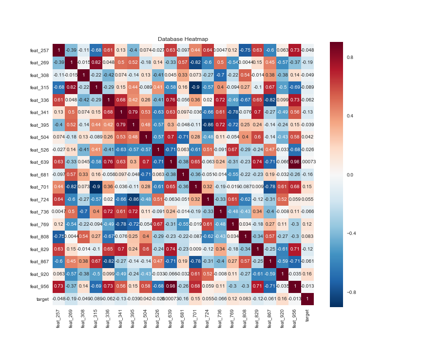
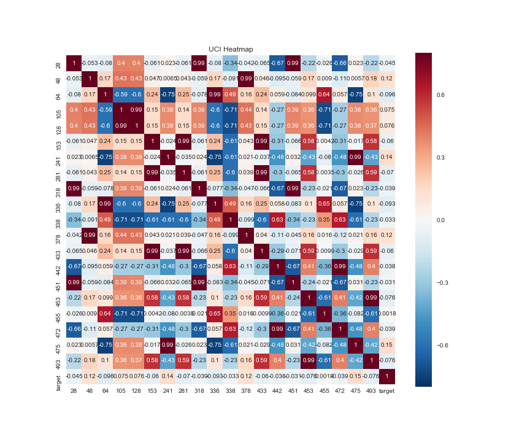

I used the method below in order to eliminate redundant features.

### Method 1: SelectKbest to identify top 5 features
In this method, the goal is to find the top 5 features that would predict the target using SelectKbest pipeline with the score_function = f_regression. 

### Method 1: Results
As you can see in the results below, the top 5 features found in each of the 3 UCI sample datasets were inconsistent. The results from the database looked more promising! All 3 sample sets identified the same top 5 features.

- **UCI SKB results:**
    - UCI skb sample 1 result: 48, 128, 241, 378, 475
    - UCI skb sample 2 result: 64, 105, 241, 336, 475
    - UCI skb sample 3 result: 241, 336, 338, 472, 475
    
    
- **Database SKB results:**
    - Database skb sample 1 result:'feat_269','feat_341','feat_681','feat_701','feat_920'
    - Databaes skb sample 2 result: 'feat_269','feat_341','feat_681','feat_701','feat_920'
    - Database skb sample 3 result: 'feat_269','feat_341','feat_681','feat_701','feat_920'

### Method 2: Recursive Feature Elimination to identify top 5 features**
In this method, the goal is to find the top 5 features that would predict the target using RFE with DecisionTree as the estimator.

### Method 2: Results
As you can see in the results below, the top 5 features found in each of the 3 UCI sample datasets were inconsistent and the top 5 features found in each of the 3 Database datasets were also inconsistent. These results also varied from the results found in Method 1. 

- **UCI RFE results:**
    - UCI RFE sample 1 result: 105, 318, 336, 378, 455
    - UCI RFE sample 2 result: 48, 105, 153, 451, 475
    - UCI RFE sample 3 result: 64, 105, 318, 338, 475
    
    
- **Database RFE results:**
    - Database RFE sample 1 result:'feat_269','feat_639','feat_769','feat_808','feat_920'
    - Databaes RFE sample 2 result: 'feat_269','feat_724','feat_736','feat_769','feat_829'
    - Database RFE sample 3 result: 'feat_269','feat_736','feat_769','feat_808','feat_829'

### Method 3: Feature_importance with RandomForest
In this method, the goal is to find the top 5 features which have the highest Gini-Importance.

### Method 3: Results

As you can see in the results below, the top 5 features found in each of the 3 UCI sample datasets were inconsistent from each other other. The top 5 features found in each of the  Database sample datasets were also inconsistent. These results also varied from the results found in methods 1 and 2. 

**UCI Gini-Importance results:**

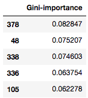 

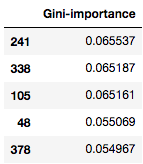

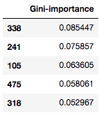

**Database Feature Importance results:**

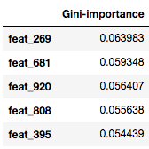

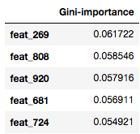

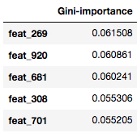

### Feature Importance Conclusions:

While there are some overlaps of features between the 3 methods, the results were inconclusive of which 5 features are the most important; therefore, I decided to keep all 20 salient features in model creation and to implement the feature reduction methods within the model pipelines.

## Step 4: Pipelines/GS to Build and Test Models

In this step, I created functions to run multiple types of pipelines and Gridsearch with different feature selection methods within the pipelines. I ran the Gridsearch for 6 sample datasets, 3 samples from UCI and 3 samples from the  Database. The following Pipelines were created:
- SelectKBest as Feature Reduction with the following classifier:
    - KNeighborsClassifier
    - LogisticRegression
    - DecisionTreeClassifier
    - RandomForestClassifier
    - SVC
- SelectfromModel with Ridgeclassifier as an estimator ran in with the following classifier:
    - KNeighborsClassifier
    - LogisticRegression
    - DecisionTreeClassifier
    - RandomForestClassifier
    - SVC
- PCA as an estimator ran in with the following classifier:
    - KNeighborsClassifier
    - LogisticRegression
    - DecisionTreeClassifier
    - RandomForestClassifier
    - SVC
Each pipeline included specific parameters related to each steps. The codes details for each Feature Reduction function and pipelines can be found in notebooks 04).

**Please note:** for the PCA method, data was only scaled and not deskewed. The sample graph below shows that the data was equally distributed within each of the 20 salient features (similar graphs for all 6 sample sets to can be found in notebooks 4).

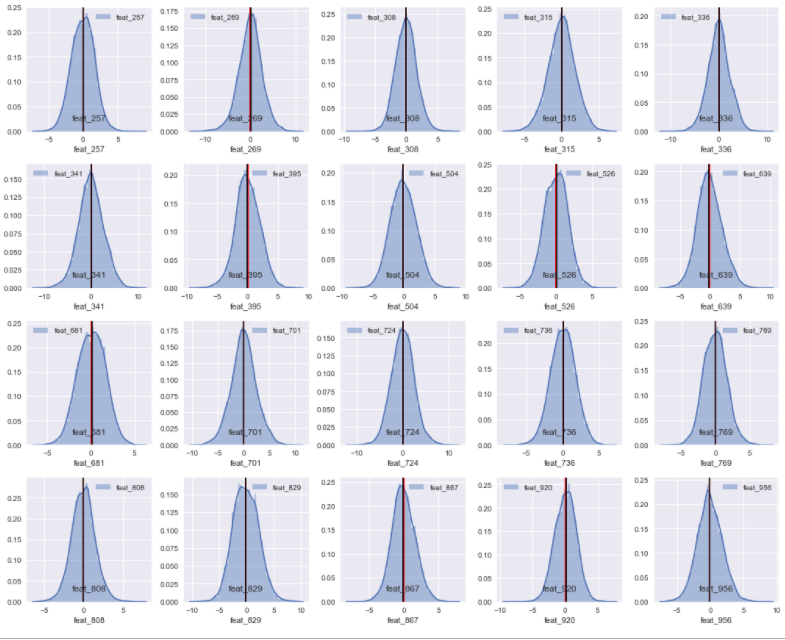

## Gridsearch Results

For each sample dataset, there were 15 results from the pipeline/gridsearch.  For the sake of space, only the top 5 scores of all results are shown below:

**Database top 5 results:**

**UCI top 5 results:**

As you can see, the best scores from both the Database and UCI were there following:
- PCA method feature reduction method
- SVC estimator
- C = 10.0
- n_components = 5

While these results aren't very high, they are higher than the benchmark results. Regularization and feature selections/reduction improved the test score by 12% for the UCI dataset and 20% for the Database dataset. This shows that by narrowing down the datasets to the top 20 salient features and using other regularization methods in the pipelines, the new models are able to better classify the the target. 
